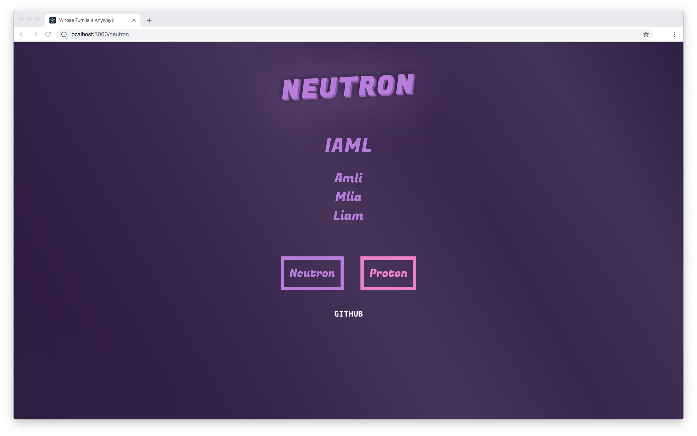

# _Whose Turn Is It Anyway?_



A basic, yet stylish team rotation for your daily rituals (like standups).

## Developing

This is a "Create React App" project, packaged via Yarn.

```shell
$ yarn install
$ yarn start
Compiled successfully!

You can now view whose-turn-is-it-anyway in the browser.

  Local:            http://localhost:3000/
  On Your Network:  http://10.10.68.209:3000/

Note that the development build is not optimized.
To create a production build, use yarn build.
```

I haven't added tests. Maybe one day?

## Configuration

### src/teams.json

#### Minimal

```json
{
  "teams": {
    "my-team": {
      "name": "My Team",
      "color": "#c377e0",
      "members": [
        {
          "name": "Bob"
        },
        {
          "name": "Petunia"
        }
      ]
    }
  }

}
```

## Deploying

Personally, I deploy this to Netlify. The default `netlify.toml` should nearly work as
a new Netlify site out-of-the-box. You will need to set a `TEAMS_JSON_URL` env variable pointing to a suitable `teams.json` to pull in at build time. I host mine on a private GitHub gist.
